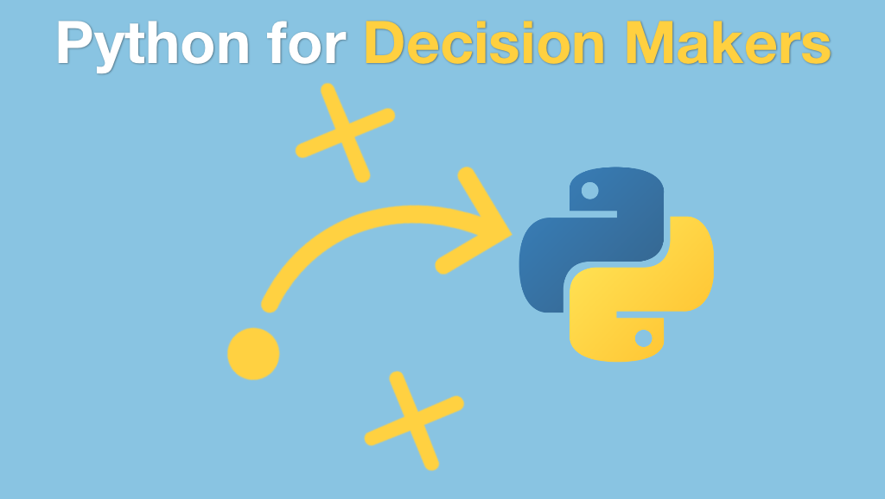

# Python for Decision Makers and Business Leaders

## Course Summary

Python has seen meteoric growth over the past few years. This means many organizations and teams are adopting Python when they previously used other technology. Why are they switching? What is it about Python that makes it so effective for organizations? If you need to learn whether Python is right for your project or your team, this course will give you a fact-based look at the Python ecosystem and show you some of the most important use-cases and even when to avoid Python.

## What's this course about and how is it different?

 This course is very unique. Most courses teach you how to program with Python. This course is a guided discussion and exploration of the Python ecosystem through the lens of your 
 organisation 
 and your team.

You will see fact-based presentations for the Python developer job space. This will answer questions like, "Is it easy or hard to hire Python developers for a given type of project?" You will see the wide spectrum of Python web frameworks and how to choose the best fit. We will explore some of the tools making Python so popular in the scientific space.

In this course, you will learn: 

- A brief history of Python and the major milestones along the way
- Python compared to common languages in popularity from multiple sources
- Python is 4 things and how to talk and evaluate about each
- Why Python is popular for both novices and pros
- Open source trends in the enterprise
- What types of applications and services you can build with Python
- Popular companies and apps built with Python
- Survey of the popular web frameworks
- See a simple (yet beautiful and functioning) web app built from scratch
- Insight into why Python works so well for data scientists
- A real-world exploration of nontrivial data using Jupyter notebooks and JupyterLab
- Scenarios of testing software and hardware in Python
- Python compared side-by-side with other candidate languages (C++, .NET, MATLAB, etc.)
- Numbers and graphs behind the Python job market
- When Python is not the best technology to choose
- And lots more

## Who is this course for?

This course is for anyone who needs to evaluate Python for their organisation. While interesting and useful for developers, you do not need to be a software developer or have experience with Python to get the big ideas from this course.

If you are in charge of deciding whether Python is right for you, your team, or your company, this is the course for you.

## Visually stunning

For online courses that spend a lot of time creating code on the fly, graphics can play a small role. But for conceptual courses like this one, hours of boring slides are a major turn off.

For this course, we put extra focus on the visual elements of the course.

## Take this course

Just [visit the course page](https://training.talkpython.fm/courses/explore_decision/python-for-decision-makers-and-business-leaders) to watch the overview video and take the course.